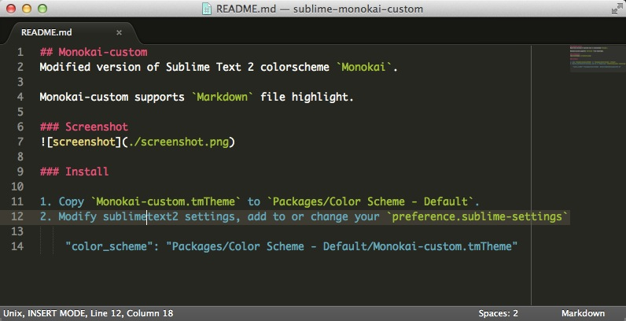

## Monokai-custom
Modified version of Sublime Text 2 colorscheme `Monokai`.

Monokai-custom supports `Markdown` file highlight.

### Screenshot

### Install

1. Copy `Monokai-custom.tmTheme` to `Packages/Color Scheme - Default`.
2. Modify sublimetext2 settings, add to or change your `preference.sublime-settings`

    "color_scheme": "Packages/Color Scheme - Default/Monokai-custom.tmTheme"